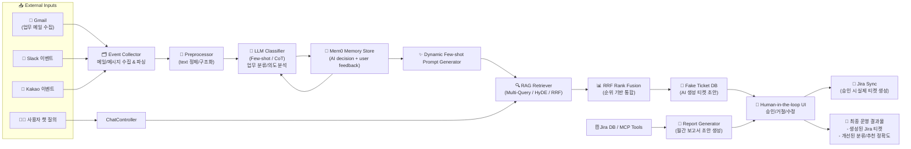

# ops_agent
운영 티켓 자동화 시스템 + Jira 실데이터 기반 RAG 성능 최적화 실험

---

## 0. 한 줄 소개
AI 기반 운영 티켓 자동화 시스템 + RAG 성능 최적화 실험 프로젝트
> Jira 실데이터를 활용한 Multi-Query, HyDE, RRF 기법 비교·검증

---

## 1. 프로젝트 배경

### AS-IS (기존 운영 프로세스)
- 업무 메일/메신저를 수동으로 확인 → 분류 → 해결 → Jira 티켓 생성
- 평균 1~3시간 소요, 중요 메일 누락 위험
- 반복 작업에 따른 인적 오류, 티켓 분류 일관성 부족

### TO-BE (AI 기반 운영 에이전트)
- Gmail/Slack/Kakao 메시지를 자동 수집
- LLM이 업무 관련성/종류를 분류
- RAG 기반으로 유사 티켓/문서를 찾아 해결 방향 추천
- Human-in-the-loop으로 운영자가 승인/거절
- 운영 리드타임(MTTC) 단축 + 자동 처리율 향상

---

## 2. 듀얼 포지셔닝

### (A) 운영 자동화 시스템
- **챗 기반 질의응답:**  
  시스템/프로젝트 관련 질문 → Jira 이슈 + 내부 문서 기반 RAG 답변
- **티켓 자동 생성:**  
  Slack/Kakao 이벤트 감지 → AI 의견 포함 “가짜 티켓” 생성 → 승인 시 Jira 반영
- **월간 보고 자동화:**  
  Jira 데이터를 기반으로 LLM이 보고서 초안 생성 → 사용자가 편집 후 완성

### (B) RAG 성능 최적화 실험 플랫폼
- Jira 실데이터를 그대로 사용해 **Retriever 성능 병목을 진단**
- 다음 기법의 실전 성능을 비교/검증
  - Multi-Query Retrieval
  - HyDE (Hypothetical Document Embeddings)
  - Chunking 전략(컬럼 단위, 가중치 기반)
  - RRF(Reciprocal Rank Fusion) 기반 결과 융합
- **MRR 기반 정량 평가로 개선 효과 측정**

---

## 3. 핵심 기능

### 3.1 챗 기반 Q&A
- 자연어 질문 의도 파악
- Jira/문서 임베딩 검색
- 프로젝트 컨텍스트 기반 답변 생성

### 3.2 Gmail 연동 및 메일 선별
- Gmail API 기반 메일 수집
- LLM이 자연어 요청을 동적 Gmail Query로 변환
- 업무 관련 메일 자동 필터링

### 3.3 Slack/Kakao 기반 티켓 자동 생성
- 이벤트 감지 → 메일/메시지 본문 전처리
- Few-shot/CoT 분류기로 업무 유형 분류
- RAG로 유사 케이스/해결책 검색
- AI 의견을 포함한 가짜 티켓 생성
- 운영자 승인 시 Jira 반영

### 3.4 Human-in-the-loop + 지속 학습
- 운영자의 approve/reject/correction을 메모리 저장
- 다음 유사 메일 분류 시 동적 few-shot 프롬프트 자동 구성
- 시간이 지날수록 분류/추천 정확도 개선

### 3.5 월간 보고 자동화
- Jira MCP 툴을 활용해 이슈/작업 추출
- LLM이 보고서 템플릿에 맞춰 초안 생성
- 에디터에서 Human-in-the-loop 최종 편집

---

## 4. RAG 고도화 & 실험 요약

### 4.1 문제
- Jira 이슈는 노이즈(식별자/로그/특수문자)가 많고 길이가 가변적
- 기본 임베딩 검색만으로는 유사도/정답 순위가 낮음

### 4.2 개선 과정
1. **데이터 정제 파이프라인**
   - 식별자/노이즈 제거, 의미 중심 텍스트 추출
2. **컬럼 단위 청킹**
   - summary/description/comment 등 의미 축 분리
3. **Chunk Weighting**
   - 제목/본문/부가정보 중요도 가중치 부여
4. **Multi-Query**
   - 질의 확장으로 검색 폭 확보
5. **HyDE**
   - 이상적 답변을 생성해 검색 깊이 확보
6. **RRF 융합**
   - 점수 체계가 다른 결과를 순위 기반으로 통합

### 4.3 결과 (MRR 기준)
- Multi-Query, HyDE 각각 단독보다  
  **RRF 통합이 가장 높은 검색 품질을 달성**
- 복합 키워드/불완전 질의에서 정답 순위 안정화
- Retriever 후보군 부족 실패 케이스를 다음 개선 목표로 도출

## 5. 시스템 아키텍처 (요약)

